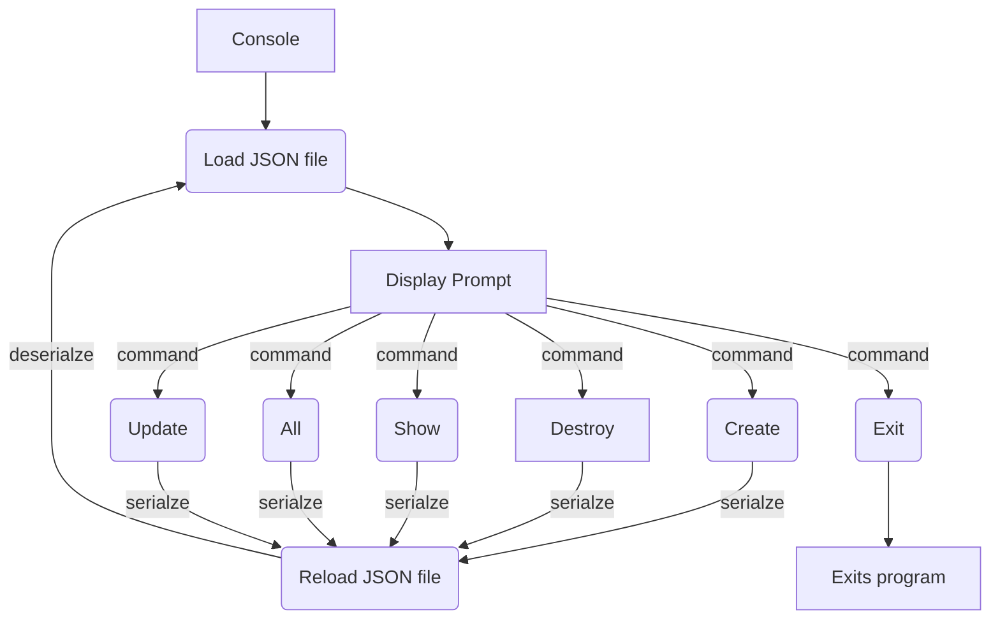

# Atlas AirBnB Clone Project
This is the second version of an AirBnB Clone project where the console can now be used to store objects and/or retrieve objects using either a MySQL database, or a JSON file.

1. [Files and Descriptions](#Files-and-Descriptions)
2. [Usage](#Usage)
3. [Flowchart](#Flowchart)

## Files and Descriptions
### console.py
The console is the entry point of the command interperter. The current commands that are supported are:
* `Exit/EOF` - exits console.
* `create` - Creates a new instance of 'BaseModel', saves it to the JSON file, then prints the id.
* `show` - Prints the string representation of an instance based on the class name and id.
* `destroy` - Deletes an instance based on the class name and id, then saves the changes to the JSON file.
* `all` - Prints all string representions of all instances based on the class name.
* `update` - Updates an instance based on the class name and id by updating or adding attributes, then saves changes to the JSON file.

### models/base_model.py
Contains the BaseModel Class that all other classes inherit from. (BaseModel Class and all other classes are in the models directory)
#### attributes
* `id` - unique user id using uuid module.
* `created_at` - The time the user was created in isoformat using datetime module.
* `updated_at` - The time any user is updated in isoformat using datetime module.
#### methods
* `def __init__(self, *args, **kwargs)` - Initializes the base model.
* `def __str__(self)` - returns the string representation of the base model.
* `def save(self)` - Updates the "updated_at" attribute with the current isoformatted datetime.
* `def to_dict(self)` - returns a dictionary containing the keys and values of an instance.

### models/amenity.py
A class that inherits from BaseModel
#### attributes
* `name` - empty string
* `state_id` empty string

### models/city.py
A class that inherits from BaseModel
#### attributes
* `name` - empty string
* `state_id` - empty string that will become State.id

### models/place.py
A class that inherits from BaseModel
#### attributes
* `name` - empty string
* `city_id` - emtpy string that will become City.id
*  `user_id` - empty string that will become User.id
* `description` - empty string
* `number_rooms` - integer (0)
* `number_bathrooms` - integer (0)
* `max_guest` - integer (0)
* `price_by_night` - integer (0)
* `longitude` - float (0.0)
* `latitude` - float (0.0)
* 'amenity_ids` - empty list that will become a list of amenity id's (Amenity.id)

### models/review.py
A class that inherits from BaseModel
#### attributes
* `place_id` - empty string
* `user_id` - empty string
* `text` - empty string

### models/state.py 
A class that inherits from BaseModel
#### attributes
* `name` - empty string

### models/user.py
A class that inherits from BaseModel
#### attributes
* `email` - empty string
* `password` - empty string
* `first_name` - empty string
* `last_name` - empty string

### models/engine/file_storage.py
The FileStorage Class handles JSON serialization and deserialization.
It serializes an instance to a JSON file & deserializes it back to an instance.
#### attributes
* `__file_path` string - path to the JSON file (ex: file.json)
* `__objects` dictionary - empty but will store all objects by the key: obj class name.id
        (ex: to store a BaseModel object with id=12121212,
        the key will be BaseModel.12121212)
#### methods
* `def all(self)` - returns the __objects dictionary
* `def new(self, obj)` - sets the obj in __objects dictionary with key: class name.id
* `save(self)`- serializes __objects to the JSON file (path: __file_path)
* `reload(self)` - deserializes the JSON file to __objects
        (only if the JSON file (__file_path) exists ; otherwise, do nothing.
        If the file doesn’t exist, no exception should be raised)

### setup_mysql_dev.sql
Prepares a MySQL server for the project. 

### setup_mysql_test.sql
Prepares a test MySQL server for the project.

### models/engine/db_storage.py
In DBStorage mode, everytime the backend is initialized, AirBnB creates an instance of DBStorage called 'storage'. The 'storage' object is loaded/reloaded from the MySQL database specified in HBNB_MYSQL_DB, using HBNB_MYQL_USER for user, HBNB_MYQL_PWD for password, HBNB_MYQL_HOST for the host. As class instances are modified, created, or deleted, the 'storage' object will register changes in the matching MySQL database. SQLAlchemy will be used to connect and query.

## Usage
This project uses a cmd module from python. This module helps with running our program by simplifying the commands it takes. To run the program simply type python3 console.py: 
 
From there you can type help to view all the command to run 
  

## Flowchart

 
